<!-- palette: #0F172A, #7C3AED, #22C55E | theme: pulse/signal — deep slate base, pulse violet, signal green with amber #F59E0B accents -->

<div align="center">

<!-- PULSE animated wave banner (palette colors) -->


<!-- Animated typing tagline -->
<a href="#-overview">
  
</a>

<br />
<br />

**Transform documentation sites into structured module hierarchies.**

Point Pulse at any docs site, it crawls every page, extracts structure (headings, tables, lists, code), and uses OpenAI to automatically organize and describe everything — all output as one clean JSON file.

<br />


</div>


---

## Table of Contents

| Section | Purpose |
| --- | --- |
| [Overview](#-overview) | What Pulse does and why it matters |
| [Key Features](#-key-features) | 7 powerful capabilities |
| [Demo](#-demo) | See it in action |
| [Tech Stack](#-tech-stack) | Technologies powering Pulse |
| [Architecture](#-architecture) | How the pieces fit together |
| [Getting Started](#-getting-started) | Install and run in 5 minutes |
| [Usage](#-usage) | Web UI and CLI examples |
| [Project Structure](#-project-structure) | Directory layout |
| [CLI Reference](#-cli-reference) | Complete command docs |
| [Output Format](#-output-format) | JSON structure & examples |
| [Testing](#-testing) | Adding tests |
| [Troubleshooting](#-troubleshooting) | Common issues & solutions |
| [Roadmap](#-roadmap) | Planned features |
| [Contributing](#-contributing) | How to contribute |
| [License](#-license) | MIT License |
| [Acknowledgments](#-acknowledgments) | Credits & thanks |
| [Support](#-contact--support) | Get in touch |


---

## Overview

**Pulse** is a documentation powerhouse for teams that live in the docs. Feed it a help center, API docs, or knowledge base URL, and it will:

1. **Crawl** — Walk every page on the domain (depth-1, same domain only)
2. **Extract** — Pull structure (headings, tables, lists, code) and raw content  
3. **Analyze** — Hand it to OpenAI to identify modules, submodules, and descriptions
4. **Output** — Get a clean JSON hierarchy ready to use immediately

The result is the skeleton an onboarding guide, knowledge base redesign, or product spec starts from. Use the **Streamlit web app** for exploration or the **CLI** for batch automation. Both are zero-config and ready to go.

---

## Key Features

<table>
<tr>
<td width="50%">

### Web & Crawling
- 🌐 **Domain-aware crawler** — only follows pages on the same (sub)domain
- 🚫 Smart filtering — skips assets (CSS, JS, images, PDF) and noise (CDN, wp-content)
- 🧱 **Structure-first extraction** — captures headings, lists, tables, code blocks *with relationships*
- 🕷️ **Depth-1 crawling** — main page + direct links only (fast and polite)

</td>
<td width="50%">

### AI & Output
- 🤖 **AI module mapping** — OpenAI (GPT-3.5 or GPT-4) identifies modules and submodules
- 🔤 Human-readable descriptions — each module gets an auto-generated summary
- 📊 Hierarchical organization — keeps URL graph, titles, depths, and metadata
- 🖥️ **Two interfaces** — Streamlit web app or CLI for automation

</td>
</tr>
<tr>
<td width="50%">

### User Experience
- ⚡ **Interactive output** — expandable module view, download buttons
- 📑 **Multiple tabs** — interactive view, JSON, site structure, content structure
- 🚫 **API-free demo** — "Run Demo" loads a sample map (no API key needed)

</td>
<td width="50%">

### Developer Friendly
- 💾 **Multiple output formats** — clean JSON, site structure, raw content
- 🔧 **CLI automation** — batch processing with `--save-structure` and `--save-raw-content`
- 📊 Detailed logging — progress tracking in `module_extractor.log`

</td>
</tr>
</table>

---

## Demo

The web app ships with a **"Run Demo"** button that needs *no API key* — it loads a sample module map from real documentation sites so you can feel the output before spending a token.

<div align="center">


**Real Pulse Output — Neo Help Center (condensed)**

</div>

<details open>
<summary><b>📋 Click to see a sample JSON output</b></summary>

```json
[
  {
    "module": "Authentication",
    "Description": "User authentication and access control, covering login, registration, and session management.",
    "Submodules": {
      "Login": "Username/password authentication with remember-me option",
      "Registration": "New-user signup with email verification",
      "Password Reset": "Secure password recovery via email",
      "MFA": "Multi-factor authentication (TOTP, SMS)"
    }
  },
  {
    "module": "User Management",
    "Description": "User account administration, profiles, and role-based access control.",
    "Submodules": {
      "User Profiles": "View and edit user account details",
      "Permissions": "Role assignment and permission management",
      "Teams": "Organize users into teams and groups"
    }
  }
]
```

</details>

---

## Tech Stack

<div align="center">


</div>

| Category | Tool | Details |
| --- | --- | --- |
| 🐍 **Language** | Python 3.8+ | Core runtime |
| 🖥️ **Web UI** | [Streamlit](https://streamlit.io) | Interactive data app framework |
| 🌐 **HTTP & Crawling** | `requests`, `aiohttp` | Network calls with async support |
| 🧹 **HTML Processing** | BeautifulSoup4, Trafilatura, html2text | Content extraction & parsing |
| 🧠 **AI & Orchestration** | OpenAI API, LangChain | GPT-3.5-turbo / GPT-4 integration |
| ⚙️ **Utilities** | python-dotenv, nest_asyncio | Environment & async helpers |

---

## Architecture

```mermaid
%%{init: {'theme':'base', 'themeVariables': {'primaryColor':'#0F172A','primaryBorderColor':'#7C3AED','primaryTextColor':'#ffffff','lineColor':'#22C55E','secondaryColor':'#F59E0B','tertiaryColor':'#0F172A','tertiaryBorderColor':'#22C55E'}}}}%%
flowchart LR
    subgraph Input["Input & Validation"]
        URL["Doc URLs"] --> Validate["validate_urls"]
    end
    
    Validate --> Crawler["Crawler<br/>(utils/crawler.py)"]
    Crawler -->|"Same domain<br/>Depth 1"| Pages["Fetch Pages"]
    Pages --> Structure["Extract Structure<br/>Headings, Lists<br/>Tables, Code"]
    Structure --> Meta["Build Metadata<br/>Hierarchy, Titles<br/>Depths, Details"]
    
    Meta --> Extractor["ModuleExtractor<br/>(utils/extractor.py)"]
    Extractor -->|"Chunked Text"| OpenAI["OpenAI API<br/>GPT-3.5/GPT-4"]
    OpenAI --> JSON["Generate JSON<br/>Modules &<br/>Submodules"]
    
    JSON --> Streamlit["Streamlit UI<br/>(app/app.py)"]
    JSON --> CLI["CLI Output<br/>(scripts/cli.py)"]
    
    Streamlit -->|"--save-structure"| StructJSON["structure.json"]
    CLI -->|"--save-content"| ContentJSON["content.json"]
```



> **Note:** The crawler deliberately stops at **depth 1** (main page + directly linked pages) to keep runs fast and polite. Adjust `--max-pages` / `--delay` in the CLI if a site needs wider coverage.

---

## Getting Started

### Prerequisites

- **Python 3.8+** — match your virtual environment to this runtime
- **OpenAI API key** *(optional)* — needed for AI module extraction (web app has a key-free demo mode)

### Installation

```bash
# 1. Clone the repository
git clone https://github.com/Shikhar-Kesharwani/Pulse-Module-Extraction-AI.git
cd Pulse-Module-Extraction-AI

# 2. Create and activate a virtual environment
python -m venv venv

# Windows:
venv\Scripts\activate

# macOS / Linux:
source venv/bin/activate

# 3. Install dependencies
pip install -r requirements.txt

# 4. Set up environment variables
cp .env.example .env
# Edit .env and add your OPENAI_API_KEY
```

### Environment Variables

| Variable | Required | Description | Example |
| --- | --- | --- | --- |
| `OPENAI_API_KEY` | No¹ | OpenAI API key for module extraction | `sk-xxxxxxxxxxxxxxxx` |

¹ *Needed for AI extraction. Without it, you can still crawl sites and explore their structure.*

---

## Usage

### Web App (Streamlit)

```bash
streamlit run app/app.py
```

Then open **http://localhost:8501** and:
1. Paste one or more documentation URLs (one per line)
2. Tweak advanced options (max pages, delay, model choice)
3. Click **Extract Modules**
4. Explore results across four tabs:
   - **Interactive View** — Expandable modules with descriptions
   - **JSON Output** — Raw JSON with download button
   - **Site Structure** — Hierarchical page map
   - **Content Structure** — Headings, lists, tables & code per page

### CLI (Command Line)

```bash
# Basic: crawl docs and output modules
python scripts/cli.py --urls https://docs.example.com/

# Advanced: multiple sites, GPT-4, save structure
python scripts/cli.py \
  --urls https://docs.a.com https://docs.b.com \
  --model gpt-4 \
  --save-structure \
  --save-raw-content

# With custom delays and limits
python scripts/cli.py \
  --urls https://help.service.com \
  --max-pages 200 \
  --delay 1.0 \
  --output my_modules.json

# Provide API key inline (useful in CI/CD)
python scripts/cli.py \
  --urls https://docs.example.com \
  --api-key sk-xxxx
```

---

## Project Structure

```
Pulse-Module-Extraction-AI/
├── app/
│   └── app.py                     # Streamlit web UI
│                                  # - URL input, advanced options
│                                  # - 4-tab results (interactive, JSON, structure, content)
│                                  # - Demo mode with no API key needed
│
├── scripts/
│   └── cli.py                     # Command-line interface
│                                  # - Batch processing
│                                  # - All output options
│                                  # - Logging to module_extractor.log
│
├── utils/
│   ├── crawler.py                 # Crawler class
│   │                              # - Same-domain BFS crawling
│   │                              # - Structure & metadata extraction
│   │                              # - Page title, hierarchy tracking
│   │
│   └── extractor.py               # ModuleExtractor class
│                                  # - Text chunking for token limits
│                                  # - OpenAI API integration
│                                  # - Module hierarchy building
│
├── .env.example                   # Environment template
├── requirements.txt               # Python dependencies
├── .gitignore                     # Standard Python ignore rules
├── README.md                      # This file
│
└── Sample Outputs
    ├── output-neo-space.json      # Neo help center modules
    ├── output-wordpress.json      # WordPress docs modules
    └── output-zluri.json          # Zluri SaaS docs modules
```

---

## CLI Reference

### Command Syntax

```bash
python scripts/cli.py --urls <URL> [<URL> ...] [OPTIONS]
```

### Arguments & Flags

| Flag | Type | Default | Description |
| --- | --- | --- | --- |
| `--urls` | `str+` | *(required)* | One or more documentation URLs (space-separated) |
| `--output` | `str` | `extracted_modules.json` | Output file for JSON module map |
| `--max-pages` | `int` | `100` | Maximum pages to crawl per URL |
| `--delay` | `float` | `0.5` | Seconds to wait between HTTP requests |
| `--model` | `str` | `gpt-3.5-turbo` | OpenAI model: `gpt-3.5-turbo` or `gpt-4` |
| `--save-structure` | flag | off | Also write `_structure.json` with URL hierarchy |
| `--save-raw-content` | flag | off | Also write `_content.json` with raw page text |
| `--api-key` | `str` | from `.env` | OpenAI API key (overrides environment) |

### Examples

<details>
<summary><b>View complete CLI examples</b></summary>

```bash
# Example 1: Single site, defaults
python scripts/cli.py --urls https://docs.example.com/

# Example 2: Multiple sites with GPT-4
python scripts/cli.py --urls https://docs.a.com https://docs.b.com --model gpt-4

# Example 3: Save structure and content for inspection
python scripts/cli.py --urls https://help.service.com \
  --save-structure --save-raw-content

# Example 4: Custom limits (slow crawl, fewer pages)
python scripts/cli.py --urls https://docs.example.com \
  --max-pages 50 --delay 2.0

# Example 5: Custom output filename
python scripts/cli.py --urls https://docs.example.com \
  --output my_custom_output.json

# Example 6: API key inline (CI/CD friendly)
python scripts/cli.py --urls https://docs.example.com --api-key sk-xxxx

# Example 7: Save all debug outputs
python scripts/cli.py --urls https://service.com \
  --save-structure --save-raw-content --output service_docs.json
```

</details>

### Output Files

- **`<output>.json`** — Main module hierarchy (clean, ready to use)
- **`<output>_structure.json`** — URL hierarchy, page titles, depths, element counts
- **`<output>_content.json`** — Raw extracted text per page (for QA)
- **`module_extractor.log`** — Detailed run logs (pages, timing, stats)

---

## Output Format

### Module Hierarchy (Primary Output)

```json
[
  {
    "module": "Authentication",
    "Description": "User authentication and access control, covering login, registration, and session management.",
    "Submodules": {
      "Login": "Username/password authentication with remember-me option",
      "Registration": "New-user signup with email verification",
      "Password Reset": "Secure password recovery via email",
      "MFA": "Multi-factor authentication (TOTP, SMS)"
    }
  },
  {
    "module": "User Management",
    "Description": "User account administration, profiles, and role-based access control.",
    "Submodules": {
      "User Profiles": "View and edit user account details",
      "Permissions": "Role assignment and permission management",
      "Teams": "Organize users into teams and groups"
    }
  }
]
```

### Structure Metadata (`--save-structure`)

Includes URL hierarchy, page titles, heading/list/table/code counts per page, and crawl depths.

### Raw Content (`--save-raw-content`)

Raw extracted text from each page for debugging extraction quality or manual review.

---

## Testing

Currently there are no automated tests. Contributors are encouraged to add pytest-based tests for:

- Crawler URL validation and domain filtering
- HTML parsing and content extraction  
- OpenAI API integration and error handling
- CLI argument parsing and error cases
- ModuleExtractor text chunking logic

### To Add Tests

```bash
pip install pytest pytest-cov
pytest tests/ -v --cov=utils
```

---

## Troubleshooting

<details>
<summary><b>Q: "OpenAI API key not found" but I set OPENAI_API_KEY</b></summary>

**A:** Make sure your `.env` file is in the current working directory when running the app or CLI.

```bash
# Verify .env is loaded
python -c "from dotenv import load_dotenv; import os; load_dotenv(); print(os.getenv('OPENAI_API_KEY'))"
```

</details>

<details>
<summary><b>Q: Crawler is slow or hitting rate limits</b></summary>

**A:** Increase the `--delay` parameter (default 0.5 seconds):

```bash
python scripts/cli.py --urls https://docs.example.com --delay 2.0
```

Also reduce `--max-pages` if the site is very large.

</details>

<details>
<summary><b>Q: OpenAI API errors (quota, rate limit, auth)</b></summary>

**A:** Check your OpenAI account:
- Verify API key is active: https://platform.openai.com/account/api-keys
- Check usage: https://platform.openai.com/account/usage/overview
- Ensure billing is active (API keys need valid payment method)

If rate-limited, add delays between runs or upgrade your plan.

</details>

<details>
<summary><b>Q: "Connection error" when crawling</b></summary>

**A:** The site may block automated requests. Try:
- Add a longer `--delay` to appear more human-like
- Some sites require User-Agent headers (not currently configurable)
- Verify the URL is publicly accessible (no auth walls)

</details>

<details>
<summary><b>Q: Module extraction is low quality or missing content</b></summary>

**A:** Try these steps:
1. Switch to `--model gpt-4` for better accuracy (higher cost)
2. Use `--save-raw-content` to inspect what was actually extracted
3. The issue may be in crawling, not extraction — check the raw content first

</details>

---

## Roadmap

- [ ] **Async crawling** — Parallelize page fetches for 5-10x faster crawls
- [ ] **Depth-2+ support** — Recursive crawling beyond direct links
- [ ] **Caching** — Store crawled pages locally to avoid re-fetching
- [ ] **Custom extractors** — User-defined CSS selectors for specific zones
- [ ] **Output formats** — CSV, Markdown, HTML dashboard in addition to JSON
- [ ] **Streaming UI** — Real-time progress updates in Streamlit
- [ ] **Automated testing** — Complete pytest suite for all modules
- [ ] **Docker support** — One-command deployment via Docker
- [ ] **Rate-limit awareness** — Automatic backoff and retry logic
- [ ] **Multi-model support** — Claude, Ollama, or other LLM providers

---

## Contributing

We welcome contributions! Here's how to get involved:

### Reporting Issues

Open an [issue](https://github.com/Shikhar-Kesharwani/Pulse-Module-Extraction-AI/issues) with:
- Clear description of the problem
- Steps to reproduce
- Expected vs. actual behavior
- Python version and OS

### Submitting Features

1. **Fork** the repository
2. **Create** a feature branch: `git checkout -b feature/your-feature-name`
3. **Commit** your changes: `git commit -m "Add: clear description"`
4. **Push** to your fork: `git push origin feature/your-feature-name`
5. **Open** a Pull Request with a detailed description

### Development Setup

```bash
# Clone your fork
git clone https://github.com/<your-username>/Pulse-Module-Extraction-AI.git
cd Pulse-Module-Extraction-AI

# Create dev environment
python -m venv venv
source venv/bin/activate  # or venv\Scripts\activate on Windows

# Install with dev tools
pip install -r requirements.txt
pip install pytest black flake8

# Run linter
flake8 app/ scripts/ utils/

# Format code
black app/ scripts/ utils/
```

---

## License

This project is distributed under the **MIT License**. See the `LICENSE` file for full terms.

```
MIT License

Copyright (c) 2024 Shikhar Kesharwani

Permission is hereby granted, free of charge, to any person obtaining a copy
of this software and associated documentation files (the "Software"), to deal
in the Software without restriction, including without limitation the rights
to use, copy, modify, merge, publish, distribute, sublicense, and/or sell
copies of the Software, and to permit persons to whom the Software is
furnished to do so, subject to the following conditions:

The above copyright notice and this permission notice shall be included in all
copies or substantial portions of the Software.
```

---

## Acknowledgments

- **OpenAI** — GPT models powering intelligent module extraction
- **Streamlit** — elegant web framework for data applications
- **BeautifulSoup4** — HTML parsing and manipulation
- **Trafilatura** — advanced content extraction from web pages
- **LangChain** — AI orchestration and model integration
- **python-dotenv** — environment variable management
- All open-source maintainers and contributors

---

## Contact / Support

**Issues & Bug Reports:**  
Open an [issue](https://github.com/Shikhar-Kesharwani/Pulse-Module-Extraction-AI/issues) on GitHub

**Questions & Discussions:**  
Start a [discussion](https://github.com/Shikhar-Kesharwani/Pulse-Module-Extraction-AI/discussions)

**Author:**  
[Shikhar Kesharwani](https://github.com/Shikhar-Kesharwani)

---

<div align="center">


<br />

**Pulse** — Turn documentation chaos into structured knowledge.

⭐ **If this saved you time, please star the repo!**

<br />

<sub>Built with 💜 for technical writers, product managers, and developers who live in the docs.</sub>


</div>
